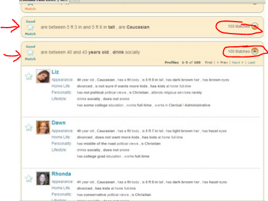

*Originally published on [pafnuty.wordpress.com](https://pafnuty.wordpress.com/2012/10/19/barac-rank-aware-interval-based-clustering/) in October 2012. Reposted here as part of pulling old writing into one place.*

---

I read this paper on 10/19/2012.
Authors
Julia Stoyanovich, [UPenn](http://maps.google.com/maps?ll=39.953885,-75.193048&spn=0.01,0.01&q=39.953885,-75.193048 (University%20of%20Pennsylvania)&t=h "University of Pennsylvania")
Sihem Amer-Yahia, [Yahoo! Research](http://research.yahoo.com/ "Yahoo! Research")
Tova Milo, [Tel Aviv Univ](http://www.math.tau.ac.il/~milo/).
Links
Original paper: [http://www.icdt.tu-dortmund.de/proceedings/edbticdt2011proc/WebProceedings/papers/edbt/a39-stoyanovich.pdf [PDF]](http://www.icdt.tu-dortmund.de/proceedings/edbticdt2011proc/WebProceedings/papers/edbt/a39-stoyanovich.pdf)**[Updated 10/19/2012. I just found a nice slideshare from Julia Stoyanovich.]**
Slideshare: <http://www.slideshare.net/yandex/julia-stoyanovich-making-intervalbased-clustering-rankaware-12174065>

### Bottom-up Algorithm for Rank Aware (Interval Based) clustering.

Comments
This paper argues that in some scenarios providing search results in a ranked manner is improved by grouping similar results such that the user is more easily able to access a varied set of matching responses. The proposal is to cluster results before presenting them to the user. Clustering is performed *locally*, that is, after applying the filter and by taking into account the user's selected ranking criterion.
The example used for the paper is based on Yahoo! personal searches. For a particular filter (age range, sex, etc), a user may select a ranking variable (e.g. income, highest to lowest). Without the proposed cluster, the user may see a long list of very similar results (perhaps software engineers) before seeing a different type of result (a different profession), and if uninterested in the first category, would have to wade inconveniently through a long list.
[caption id="attachment\_858" align="aligncenter" width="447"] A screenshot of clustered results from Yahoo! personals. Source: Julia's slideshare deck (click to view).[/caption]
The paper describes ways to measure qualities of clusters, including formal definitions, which are then used as a basis for an algorithm "BARAC" for "Bottom-up Algorithm for Rank Aware (Interval Based) clustering". It also discusses complexity and computational costs, and results from user tests.

- Interval-based clustering refers to grouping an attribute by a range of values (age between 20 and 25).
- CLIQUE -- a rank unaware clustering framework, used both as a point of comparison and a starting template for BARAC. [Agrawal 1998]
- Clustering measures are based on locality, quality, tightness, maximality.

In Conclusion
The paper is clear and easily consumed (I read it on BART), and is sufficiently descriptive to be actionable (even includes pseudo code for BARAC and most sub routines). Discusses some practical issues in implementation. Some general valuable lessons can be extracted.
