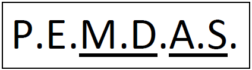
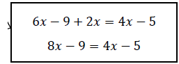
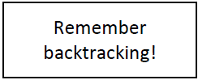
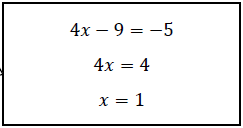

*Originally published on [pafnuty.wordpress.com](https://pafnuty.wordpress.com/2011/03/31/bodine-order-its-done/) in March 2011. Reposted here as part of pulling old writing into one place.*

---

Here's a little math rap from Tom Bodine. Play the music and follow along with the lyrics.
Be sure to check out more from Tom at his [Soundcloud page.](http://soundcloud.com/tombodine/sets/math-raps/ "Tom's Soundcloud page")

---

[soundcloud url="http://api.soundcloud.com/playlists/658310"]
Fenway you ready? Ok, then, let's lock and load.
Fenways! Yo turn me up! Ms. Kemp I think we got one. Here we go!
(Chorus)
*Tell me what do you see, you’ve got parentheses
Exponents, multiply, and then we all divide
With addition, subtraction, and all of this action, it’s the order it’s done
When you’re faced with some problems, you know that you’ve got ‘em with the process we love*

*It’s all how it’s done, your calculations, the order of operations
It’s all how it’s done, your calculations, your order of operations*
Now listen up Fenway I've got something to tell
It's a brief set of rules made so you can excel
See I know how it feels thinking “what do I do first?”
When all the while you're thinking that your head's gonna burst!
You see, MATH is for fortune and fame
MATH gets your head in the game
MATH gives you something from nothing and
NOTHING else is quite the same

**P**lease **e**xcuse **m**y **d**ear **A**unt **S**ally,
For she knows not how we do
She never used this rhyme
To help her work a problem through
P is for parentheses, simplify what's in them first
E is for the exponents, obey the power, quench the thirst
M & D is just one step, 'cause you take it left to right
A & S will bring it home, now wrap it up, our math is tight!
*(to chorus)*
3 times the quantity (5 – 7) that's *cubed*Then we're adding 65 over 13 that's the problem, dude
First I do 5 – 7, that gives me –2
–2 to the power of 3, that's –8, now follow through!
3 times –8 will get ya (*what!*) –24
13 into 65 is 5, now let's settle the score!
–24 + 5, think about your number line
Add 'em up don't forget your sign, it's –19!

It's not just for arithmetic, you can solve equations like
6x – 9 + 2x = 4x – 5
First you gotta simplify on both sides of the “=” sign
Combine your like terms on the left, and you're left 8x – 9

To break this lil' equation down
Turn your operations 'round
Gotta add or subtract on both sides
Before you can multiply or divide anymore
Subtract 4x from both sides
4x – 9 = –5
Then you add a 9 to both sides, you're almost done
Divide by 4, x = 1.

You know it's only B block, teacher put me on the spot
I tried to hide but he called my name… (you know)
And you know mistakes don't stop just 'cause you rise to the top,
You gotta stay up on your game

We're still writing, we're still learning
No more pain, no more hurting
All of my students, they're reppin' every house
Show Boston how it‟s done! Yes!
*(to chorus)*

---

*[Posted/shared with Tom's permission. Thanks to Richter for the hookup.]*
