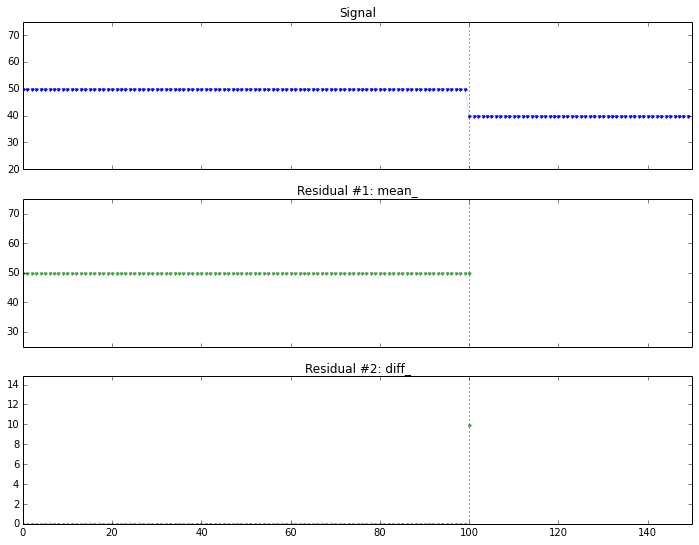

*Originally published on [pafnuty.wordpress.com](https://pafnuty.wordpress.com/2014/05/29/change-detection-tutorial/) in May 2014. Reposted here as part of pulling old writing into one place.*

---

I've been working on a tutorial on change detection. This is the first time I've attempted to write a tutorial, and it's been a useful learning process. I'm not "done" yet, but I feel it is at the point where I can announce that it exists.
While the transition from "notebooks where Aman is fooling around" to "a well-written tutorial with a narrative" is far from complete, I've invested enough time without any validation of whether anyone is actually interested in reading all this. If there's significant interest or requests, I will be happy to invest more time in cleaning up this tutorial and maybe even adding more topics.
You can check out my tutorial on change detection here:
[embed]https://github.com/amanahuja/change-detection-tutorial[/embed]

## Why a tutorial on change detection?

Change detection is a type of problem in which we want to detect an interesting change in a signal. In the tutorial, I consider the signal to be a stream of (scalar) values, and take an [online](http://en.wikipedia.org/wiki/Online_algorithm) approach to the problem. I leave it open to interpretation what we mean by "interesting change".
[caption id="attachment\_1218" align="aligncenter" width="300"] A toy signal for change detection. What kind of change is interesting? What is important to detect and what should be ignored?[/caption]
The objective of the tutorial is to introduce to discuss some fundamental concepts in change detection, to highlight some important use-cases of these algorithms, and to encourage the reader to think about the context of the problem before designing a solution.
I find this topic very interesting, and I've been fortunate to have had the chance to work on a few projects over the last years in which change detection was an important component. The problem is also tied to the more general subject of anomaly detection, which is turning out to be a recurring theme in my work.
Most importantly, I think there is a huge and growing demand in this subject. It is simply impossible to use purely manual methods to keep tabs on the tremendous amounts of data that we're generating as a society, and in many scenarios the most interesting things are those that are NOT normal -- they that fall rapidly, they rise sharply, they fit an unusual pattern or or they do not fit a usual pattern. Systems that utilize change detection algorithms -- often as part of a larger solution -- will help us sort through all our data and enable appropriate decisions to be made accurately and on time.

## Topics Covered

Some of the topics covered in the tutorial are:

- Online vs Offline algorithms, simulating online detection.
- Designing residuals and stop conditions
- Welford's method
- Comparing multiple windows on a single stream.
- Anomaly detection in EKG signals

## Some screenshots

[caption id="attachment\_1220" align="aligncenter" width="500"] Simulating online detection algorithms. Here the stopping condition (fired at the vertical red line) is triggered immediately after the change.[/caption]
[caption id="attachment\_1221" align="aligncenter" width="500"] Detecting change in a seasonal signal (shown on top). The residual (on bottom) rises sharply after change, but is resistant to the seasonal variation.[/caption]
[caption id="attachment\_1223" align="aligncenter" width="500"] We study a signal with outliers and noise, and try to design a detector sensitive to change using z-scores.I've been working on a number of problems in the past few years on change detection and anomaly detection.[/caption]

## EKG signals

To look at EKG signals, I borrowed from Ted Dunning's presentation at Strata. I recreated his solution in python (his solution, available on github at [embed]https://github.com/tdunning/anomaly-detection/[/embed] uses Java and Mahout).
I actually haven't finished writing this section yet, it's an exciting enough topic that I feel I could sink a lot of time into it. I spent (only) several hours reading and ingesting the EKG data, and (only) several more hours re-writing Ted Dunning's algorithm. But after that initial effort, I put in a large amount of intermittent effort trying to make this section presentable and useful for a tutorial -- and therein lies the time sink. I'll fix this section up based on feedback from readers.

[caption id="attachment\_1225" align="aligncenter" width="500"] EKG signal[/caption]
[caption id="attachment\_1224" align="aligncenter" width="500"] Using clustering, we construct a dictionary of small signal windows from which to reconstruct a full signal. Here are a few of the windows in the dictionary.[/caption]
Ted Dunning's approach to anomaly detection in EKG signals is as follows. First, a dictionary of representative small segments (windows) is created. These windows are found by using k-means clustering on a "normal" EKG signal. This dictionary, constructed from the training data, is used to reconstruct the EKG signal of interest.
If a test signal is successfully reconstructed from the dictionary, the signal is much like those found in the training data, and can be considered normal. If the reconstruction has a high error rate, there's something in the signal that may be anomalous, suggesting a potentially unhealthy EKG that should be investigated further.
[caption id="attachment\_1226" align="aligncenter" width="500"] A reconstruction (bottom row) of an EKG signal (middle row). The top row shows both signals superimposed.[/caption]
I have not tuned the model in the tutorial; there is room for improvement in the training phase, parameter selection, and other adjustments. That's another potential time sink, so I've temporarily convinced myself that it's actually better, for a tutorial, to leave that as an exercise for the reader.
If all this sounds interesting, please do take a look at the tutorial here:
[embed]https://github.com/amanahuja/change-detection-tutorial[/embed]
I'll be happy to receive any comments or feedback!
