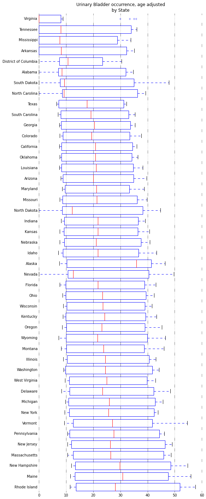
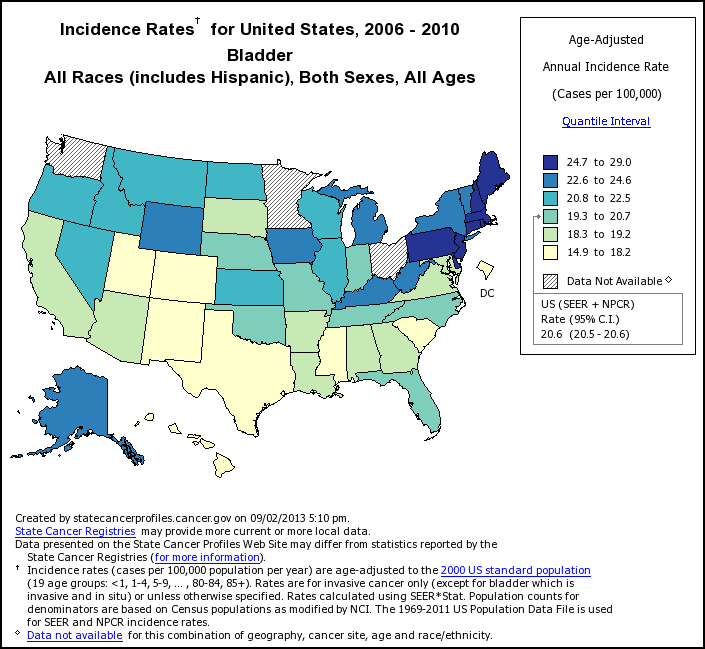

*Originally published on [pafnuty.wordpress.com](https://pafnuty.wordpress.com/2013/09/02/data-gov-open-government-platform-and-cancer-data-sets/) in September 2013. Reposted here as part of pulling old writing into one place.*

---

After attending a lecture at [University of San Francisco](http://maps.google.com/maps?ll=37.7794444444,-122.451944444&spn=0.01,0.01&q=37.7794444444,-122.451944444 (University%20of%20San%20Francisco)&t=h "University of San Francisco") by Jonathan Reichental (@Reichental) on the use of [open data](http://en.wikipedia.org/wiki/Open_data "Open data") in the public sector, I started poking around some data sets available at [Data.gov](http://Data.gov).
Data.gov is pretty impressive. The site was established in 2009 by [Vivek Kundra](http://en.wikipedia.org/wiki/Vivek_Kundra "Vivek Kundra"), the first person with the title "Federal CIO" of the United States, appointed by Barack Obama.  It is rapidly adding data sets; sixty-four thousand [data sets have been added](http://www.data.gov/metric/federalagency/dataset-published-per-month) just in the last year.
Interestingly, there is an open-source version of data.gov itself, called the [open government platform](http://www.opengovplatform.org/). It is built on Drupal and available on [github](https://github.com/opengovplatform/). The initiative is spear-headed by the US and the Indian governments, to help promote transparency and citizen engagement by making data widely and easily available. Awesome.
The Indian version is: [data.gov.in](http://data.gov.in/). There is also a [Canadian version](http://data.gc.ca/), a [Ghanaian version](http://data.gov.gh/), and many other countries are following suit.
I started mucking around and produced a plot of the [Age-adjusted](http://en.wikipedia.org/wiki/Age_adjustment "Age adjustment") [Urinary Bladder cancer](http://www.everydayhealth.com/bladder-cancer/bladder-cancer-basics.aspx "Bladder Cancer") occurrence, by state.

- The data was easy to find. I downloaded it without declaring who I am or why I'm downloading the data, and I didn't have to wait for any approval.
- The data was well-formatted and trivially easy to digest using python [pandas](http://pandas.pydata.org/).
- Ipython notebook and data source available below.

- iPynb (Python code to import data and generate plot): <http://nbviewer.ipython.org/6417852>
- Data from: http://wonder.cdc.gov/cancer.html

If you're interested in this data, you should also check out <http://statecancerprofiles.cancer.gov/> , which I didn't know existed until I started writing this post. I was able to retrieve this map from there:

