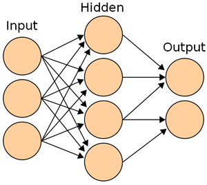

*Originally published on my old blog, [Pafnuty blog](/posts/explanation-of-lenet-jargon/). Reposted here as an effort to [consolidate writing](/posts/consolidating-my-writing/) into one place. The original publication date was: June 13, 2009.*

---

In my [last post](/posts/yann-lecun/) I said:
> The technology behind the ATMs was developed by LeCun and others almost 10 years ago, at AT&T Bell Labs... The algorithm they developed goes under the name LeNet, and is a multi-layer backpropagation Neural network called a Convolution Neural Network.  I will explain this terminology in my next post.

**ANNs** are mathematical models composed of interconnected nodes. Each node is a very simple processor: it collects input from either outside the system or from other nodes, makes a simple calculation (for example, summing the inputs and comparing to a threshold value) and produces an output.

ANNs are usually composed of several layers. There are a number of input nodes -- imagine 1 node for each input. Similarly, there is an output layer. Between these two there can be one or more 'hidden' layers, so called because they only interact with other nodes and are therefore invisible outside the system. The addition of hidden nodes allows greater complexity in the system. Choosing the number of and architecture of hidden nodes is an important consideration in the design of an ANN. The description of LeNet as a "**multi-layer ANN**" indicates that one or more hidden layers are used.

:   Layers of a Artificial Neural Network

"**Backpropagatio**n" is by far the most common type of ANN in use today. The development of the backpropagation technique was very significant and was responsible for reviving interest in ANNs. After the initial excitement due to Rosenblatt's development of the Perceptron (in 1957), which some people (briefly) believed was a algorithm-panacea, researchers hit a brick wall due to the limitations of the perceptron. Minsky and Papert published one of the most important papers in the field (in 1969) that proved this limitation and drove the proverbial nail in the coffin. Work and interest in ANNs practically vanished. In the 1980's ANNs were revived by the work on backpropagation techniques by Rumelhart and others.

Which doesn't really answer the question. What is backpropagation and how did it overcome these limitations? The question deserves a dedicated discussion, but imagine the flow of information through a multi-layer neural network such as the one in the picture above. We start at the input layer, where external input enters the system. The input nodes pass this along to the hidden nodes. Each hidden node sums up the input from several input nodes, and compares it to some threshold value.  -- 1) This sum is in fact a weighted sum -- we assign a weight to each node which determines how significant that node's contribution will be.  2) We will then employ a mathematical function such as the logistics function to compare the sum to our 'threshold' value.  This is done so that we don't have to work with a hard-limiter function, which would give us a less useful yes/no. --  The result from our hidden node is passed along to one or more output nodes (unless there is another hidden layer).  The output nodes follow the same process and then pass along their output which leaves the system as the final output.  Information has moved *forward* through our network.

This final output will hopefully be correct, but, during training, it will be wrong or not sufficiently close to the right answer. We can tell the network which of these is the case -- this is called 'supervised learning' -- by calculating the error in each of the output nodes. Now we will go backwards through the system: each of the output nodes must adjust its output, and then pass back information to the hidden layer so that each of those nodes can also adjust its output. The way in which the network adjusts its output is by changing weights and threshold values. The exact method used to decide how much to adjust these values is clearly very important, but the general principle we have employed is the backwards propagation of errors -- this is the revolutionary 'backpropagation' technique.

Which brings us to the final term: "convolution", which I was completely unfamiliar with. After doing some research, here's my first attempt at an explanation -- please Email me or leave a comment if I have something wrong and I will make the necessary revisions.

A **convolution neural network** is special architecture (arrangement of layers, nodes, and connections) commonly used in visual and auditory processing which more specifically defines a spacial relationship between layers of nodes. Imagine we are trying to recognize objects from a picture, which we subdivide into a coarse grid and then subdivide further into progressively finer grids. We could define node connections in such a way that a single grid unit (pixel) from layer *l* corresponds only to a block of pixels in layer (*l + 1)*. We use this limitation to increase efficiency.  Since we are now dealing with many layers, we choose to create an interpretation of output several times, not just at the end.  The first time we do this we look for coarse information, like edges, then something more refined. CNN architectures are usually characterized by local receptive fields, shared weights, and spatial or temporal subsampling.

[Update: check out a [Matlab class for CNN implementation](http://www.mathworks.com/matlabcentral/fileexchange/24291 "Matlab class for CNN") on the Matlab file exchange, by Mihail Sirotenko.]

Put together, LeCun tells us that LeNet is a "multi-layer backpropagation Neural network called a Convolution Neural Network".

[Return to the post about LeCun's visual processing algorithm.](/posts/yann-lecun/ "Yan LeCun post")
