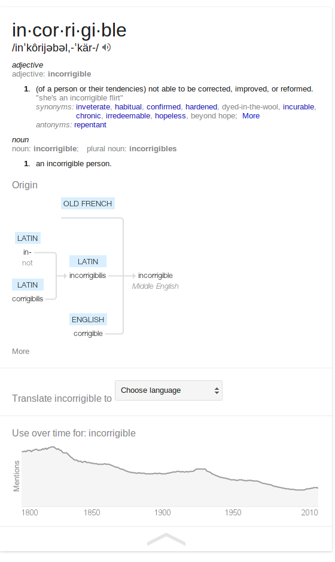

*Originally published on my old blog, [Pafnuty blog](https://pafnuty.wordpress.com/2013/10/31/google-search-definitions-upgrade-is-amazing/). Reposted here as an effort to [consolidate writing](/posts/consolidating-my-writing/) into one place. The original publication date was: October 31, 2013.*

---

Have you used a Google search to look up the definition of a word recently?

For a long while now, Google has returned a definition from some online dictionary or wiki. Now, not only has the definition section improved, but you also get the word usage over time (from [Google Book n-grams](https://books.google.com/ngrams)) and a very cool etymology tree.

I'd love to find out more about how that etymology visual is being generated!

