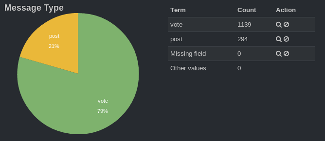
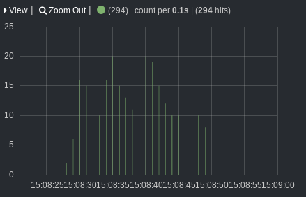

*Originally published on [pafnuty.wordpress.com](https://pafnuty.wordpress.com/2013/09/26/kibana-disqus-at-sf-python-project-night/) in September 2013. Reposted here as part of pulling old writing into one place.*

---

At the #SFPython Project night earlier this week, [Disqus](http://www.disqus.com/ "Disqus") gave us access to a pipeline of their data. Their data is composed of conversations (posts, comments, and votes) taking place throughout the web. As one of the largest blog (*the* largest?) blog comment-hosting services, they have a large amount of data.

## The Data

The data we had to work with was streaming JSON. Mostly we were there for beer, food, and socializing, but in between sips we managed to make some efforts in tinkering with it.

## Hacks

[Rob Scott of Inkling](http://www.linkedin.com/pub/robert-scott-r2/1/702/402) was only there for about 20 minutes, but he had enough time to throw together a sweet recursive python script that made it easy to parse out fields in the streaming [JSON](http://en.wikipedia.org/wiki/JSON) data. <https://gist.github.com/rbscott/6694512>
I wrote a script to examine documents in the stream and conditionally add an event to one of several [time-series](http://en.wikipedia.org/wiki/Time_series "Time series"). I was planning to use the stream to populate time series for things like "Votes", "Posts by Users with n+ followers" "Comments by female users", "Likes by Users in South America" etc. Then I hoped to use some existing time series anomaly detection libraries. I abandoned this effort in favor of a different idea...
[Bobby Manuel of Shoptouch](http://www.linkedin.com/pub/bobby-manuel/0/71a/45a) walked by and suggested using [ElasticSearch](http://www.elasticsearch.org/) + [Kibana](http://www.elasticsearch.org/overview/kibana/), which works very well with JSON data. We all agreed this was a great idea. It is also exactly the kind of thing that's great for a hackathon -- a pretty impressive output for a very small amount of work.

## Elasticsearch + Kibana, very quickly

There wasn't much time left when Bobby shared his idea. I had to start from scratch, installing Elasticsearch and Kibana, so I took several shortcuts. Instead of working with the JSON stream, I piped a few seconds of the data to a file, indexed it via bulk import in Elastic Search, and setup a Kibana dashboard.
The following are a few screenshots of the results. The first shows a breakdown of events in the pipeline by Message Type (Vote, Post, Threadvote, etc).
[caption id="attachment\_1126" align="aligncenter" width="668"] Disqus events by message\_type[/caption]
The second is what Kibana calls a "histogram" -- I would find a different name -- showing counts of events in buckets of 100 milliseconds. The interesting thing here is that Kibana easily parsed the timestamp once I specified the field. I was also able to filter by time ranges.
[caption id="attachment\_1127" align="aligncenter" width="439"] Histogram of events by time[/caption]
There were some other interesting screenshots that I will not post here since I don't actually own this data.  but I was starting to explore the actual content of the data and users. A simple query revealed that "LOL" is more common than "ha". The Disqus API allowed me to look up user details by the user id in the stream, so there is potential for augmenting the [data stream](http://en.wikipedia.org/wiki/Data_stream "Data stream") in various ways.

## Next?

This didn't take much time; the biggest time-suck was what I thought was an encoding/unicode related error during the bulk import. If I had had more time I would have liked to work with the actual JSON data stream rather than a small segment of it.
One step would be to ease resource constraints by using something better than my little laptop. An EC2 instance would be enough, I think for a hack it would be just fine to stick ES and Kibana on the same box.
The second step would be to find an easy way to continually index the stream in Elasticsearch. One approach would be to use the pipe input API in [Logstash](http://www.elasticsearch.org/overview/logstash/) (<http://logstash.net/docs/1.2.1/inputs/pipe>). I was already using curl to pipe the data stream to stdin, so this would be a straightforward proof-of-concept. Easy trumps robust for hacks. Alternately, I could have writen a script that catches the incoming JSON documents, adds the necessary metadata, and XPUTs them into Elasticsearch.  I explored neither of these approaches, and had another burrito instead.

## Conclusion

I'm almost embarrassed that the Elasticsearch family of tools wasn't already in my tool-belt for [exploratory data analysis](http://en.wikipedia.org/wiki/Exploratory_data_analysis). They are now. It takes much less time that I had expected to set up and get useful results.  They are flexible with various types of input. And the above hacks barely scratch the surface of what is possible to do with ES.
These tools aren't just for finely tuned production environments to deliver specific functionality around search.  Give them a try for data exploration and quick results ... and hackathons.

---

/cc @bobbymanuel @cpdomina @northisup @rbscott7 @disqus
