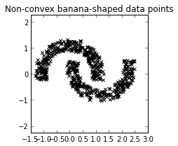
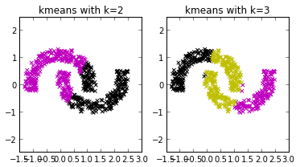
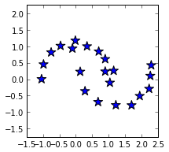
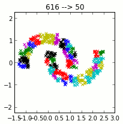
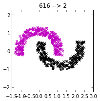

*Originally published on [pafnuty.wordpress.com](https://pafnuty.wordpress.com/2013/08/14/non-convex-sets-with-k-means-and-hierarchical-clustering/) in August 2013. Reposted here as part of pulling old writing into one place.*

---

## Bad mouthing old friends

I got into a conversation recently about [k-means clustering](http://en.wikipedia.org/wiki/K-means_clustering "K-means clustering") --  you know, as you do -- and let me tell you, poor k-means was really getting bashed. "K-means sucks at this", "K-means can't do that". It was really rather vicious, and I felt I had to step up to defend our old friend k-means. So I started writing up something that shows that those oft-highlighted weaknesses of k-means aren't nearly bad as people think, and in most cases don't outweigh the awesomeness that k-means brings to the party.
It started to get quite lengthy, so I'm breaking it up into pieces and maybe I'll put it all together into one thing later. This post is the first of those pieces.

## Convex sets

"K-means can't handle non-convex sets".
[caption id="" align="alignleft" width="100"] A non-convex set[/caption]
*Convex sets: In Euclidean space, an object is convex if for every pair of points within the object, every point on the straight line segment that joins them is also within the object. [[Source: Wikipedia.](http://en.wikipedia.org/wiki/Convex_set)]*
The k-means algorithm, in its basic form, is like making little circular paper cutouts and using them to cover the data points. We can change the quantity and size and position of our paper cut-outs, but they are still round and, thus, these non-convex shapes evade us.
That is, what are doing when we use k-means is constructing a mixture of k-gaussians. This works well if the data can be described by spatially separated hyper-spheres.
Here's a clustering example, borrowed directly from the [sklearn documentation on clustering](http://scikit-learn.org/stable/modules/clustering.html). These are two slightly entangled banana spheres. That's *two*non-convex shapes, and they are not spatially separated.

When we try to use k-means on this example, it doesn't do very well. There's just no way to form these two clusters with two little circular paper cut-outs. Or three.
[caption id="attachment\_1093" align="aligncenter" width="373"] k-means performs poorly on the banana shapes[/caption]

## K-means pairs well

But by combining k-means with another algorithm, [hierarchical clustering](http://en.wikipedia.org/wiki/Hierarchical_clustering "Hierarchical clustering"), we can solve this problem. Pairing k-means with other techniques turns out to be a very effective way to draw from its benefits while overcoming its deficiencies. It's like our theme. I'll do it again in another post, just you watch.
First, we cluster the data into a large number of clusters using k-means. Below, I've plotted the centroids of clusters after k-means clustering using 21. [Why 21? Well, actually, it doesn't matter very much in the end.]
[caption id="attachment\_1096" align="aligncenter" width="215"] Centroids of 21 k-means clusters[/caption]
Then, we take these many clusters from k-means and then start clustering *them* together into bigger clusters using a [single-link](http://en.wikipedia.org/wiki/Single-linkage_clustering "Single-linkage clustering") agglomerative method.  That is, we repeatedly pick the two clusters that are closest together and merge them. It is important in this scenario that we use the "single-link" method, in which the distance between two clusters is defined by the distance between the two closest data points we can find, one from each cluster.
Here's what that looks like:

Woah woah. Did you see that one near the end? The one where we've taken 616 data points, formed a whole bunch [I used k=51 for the animation to get lots of colorful frames] of clusters with k-means , and then agglomerated them into ... this:

Yup, that one. So pretty.

## So many benefits

You get it already, I'm sure. We're making lots of those little circles, covering all the data points with them. Then, we are attaching the little circles to each other, in pairs, by repeatedly picking the two that are closest.
K-means and single-link clustering. Combining the two algorithms is a pretty robust technique. It is less sensitive to initialization than pure k-means. It is also less sensitive to choice of parameters. When we have many points, we use an algorithm that is fast and parallelizable. After the heavy lifting is done, we can afford to use the more expensive hierarchical method, and reap its benefits, too.
There are many additional problems with k-means: sensitivity to initialization, the need to pick k, poor performance in high-dimensions. Today we looked at those damn non-convex sets. I'll dive into some of the others in future posts.
By the way, in the banana shapes solution today, note that we don't have to specify ahead of time the expected final number of clusters. We specified some arbitrary large number for k, but we finished up with hierarchical clustering. We could use one of many well-studied techniques to decide when to stop clustering. For example, we could automate a stopping rule using concepts of separation and cohesion -- [see this post](http://pafnuty.wordpress.com/2013/02/04/interpretation-of-silhouette-plots-clustering/ "Interpretation of Silhouette Plots (Clustering)") for a hint.
Related posts:

- [Interpretation of Silhouette Plots (Clustering)](http://pafnuty.wordpress.com/2013/02/04/interpretation-of-silhouette-plots-clustering/ "Interpretation of Silhouette Plots (Clustering)")
