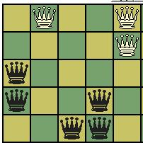
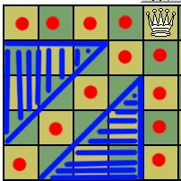

*Originally published on my old blog, [Pafnuty blog](https://pafnuty.wordpress.com/2009/07/17/queen-problems/). Reposted here as an effort to [consolidate writing](/posts/consolidating-my-writing/) into one place. The original publication date was: July 17, 2009.*

---

> Can you place three white queens and five black queens on a 5×5 chessboard so that no queen of one color attacks a queen of the other? The solution is unique, except rotations and reflections.

It took me longer than I first expected to solve this problem. The solution is: 

A queen attacks along rank, file, and diagonal, leaving triangles between them un-attacked. The square corresponding to one knight's move corresponds to the closest vertex of each triangle. While that is immediately obvious to anyone familiar with chess, I was able to solve the problem by thinking about placing white queens in such a way as to allow the largest triangles. Before searching for a solution in that manner, I tried other methods unsuccessfully: hit-and-miss attempts (having at first underestimated the problem); placing queens at knight-moves as one might do for the classic eight-queen problem (see below); utilizing symmetry by placing queens at, say, each corner and at the center; and so on.

So how would a computer solve the problem? Well, a [wikipedia article](http://en.wikipedia.org/wiki/Eight_queens_puzzle#The_eight_queens_puzzle_as_an_exercise_in_algorithm_design "Eight Queens Problem on Wikipedia") suggests, among other methods, a genetic algorithm, which struck my fancy.  So I started writing one.

After the skeleton of the algorithm was written and I started tinkering with parameters and the fitness function, I realized this problem would make a great introduction to genetic algorithms and also provide a simple platform for various discussions about the nuances of GAs. I hope to write about that later, especially if there's interest.
