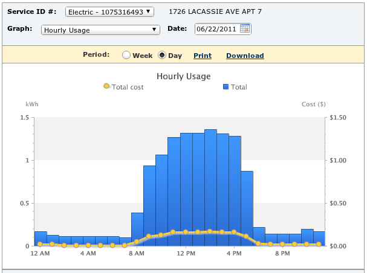

*Originally published on my old blog, [Pafnuty blog](https://pafnuty.wordpress.com/2011/06/23/san-francisco-walnut-creek-heat-wave-june-2011/). Reposted here as an effort to [consolidate writing](/posts/consolidating-my-writing/) into one place. The original publication date was: June 23, 2011.*

---

I gave in this week. I turned on the air conditioner at my apartment.



Not only did I use my A/C, I actually left it on 'economy mode' while I was at work. This resulted in the dramatic spike in the graph above, where my energy consumption shot up to about 13 kilo-Watt-hours, compared to my average of ~3 KwH in May and ~4 kWH in the rest of June.

Was it really all that hot? Weather underground says that it got up to 101 degrees in those two days at the nearby BART station. And if you've ever been to my apartment, you know that when you walk up to my door the temperature rises palpably with each step. I can honestly estimate it must have been 110 degrees F in my living room.



I have colleagues in India (Kalkaji, in New Delhi), and this week their temperatures were [quite comparable](http://www.wunderground.com/history/airport/VIDP/2011/6/24/WeeklyHistory.html) to this. I definitely will *not* jump on this rare opportunity to whine safely, though, lest they point out that their temperatures, while similar to ours *this* week, were actually abnormally cool compared to their own averages and norms. I wouldn't hear the end of it for 51 weeks.

I'll try to keep the broader perspective, but I'm just not very good with heat. And I'm simultaneously stubborn with turning on the air conditioner. Fortunately for me, the temperature dropped back down by about 20 degrees today, and I am comfortable with the windows open and a supply of water, Gatorade, and ice cream.
