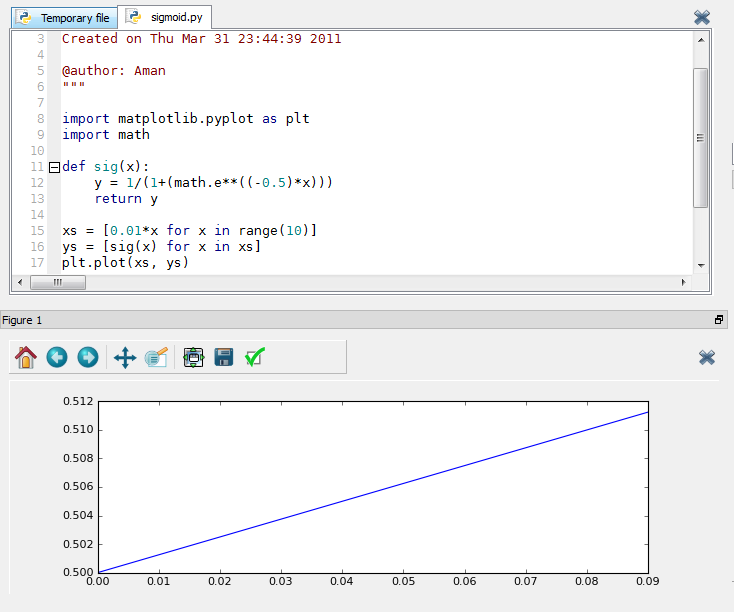

*Originally published on [pafnuty.wordpress.com](https://pafnuty.wordpress.com/2011/04/01/sigmoid-function-fail/) in April 2011. Reposted here as part of pulling old writing into one place.*

---

Plot the sigmoid function.

$latex sig(u)=\frac{1}{1+e^{-u}}$

[caption id="attachment\_445" align="aligncenter" width="640"] Does this look sigmoidal to you?[/caption]
A result that confused me until [Thanks, Sasha] I noticed the tick values on my x-axis, which matplotlib selected unintelligently.  If we simply correct the plot domain.
`xs = [0.01*x for x in range(-1000,1000)]`

I would like to know more about how different plotting packages, such as matplotlib and ggplot2 in R, select default values for xrange and yrange.
