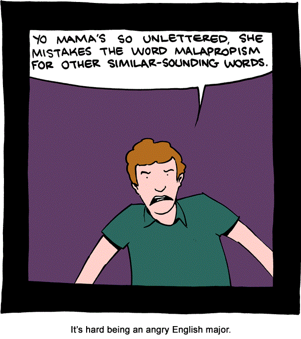

*Originally published on my old blog, [Pafnuty blog](https://pafnuty.wordpress.com/2012/10/12/the-lost-malapropisms-on-wikipedia/). Reposted here as an effort to [consolidate writing](/posts/consolidating-my-writing/) into one place. The original publication date was: October 12, 2012.*

---

Inspired by SMBC, I checked out the [Wikipedia article on malapropisms](http://en.wikipedia.org/wiki/Malapropism), which provided some history and entertaining examples of malapropisms -- "the substitution of an incorrect word for a word with a similar sound, especially with humorous results".

As awesome as the examples on Wikipedia were, they were so few. I checked the [Wikipedia Talk page](http://en.wikipedia.org/wiki/Talk:Malapropism) to see if there were any more there -- there were not, but I learned that there used to be more many more examples in the article that were removed because, well, you only need so many examples to explain what a malapropism is.
That reasoning is fine for Wikipedia, but I wanted more than education. I wanted entertainment, damnit! I wanted to read more great malapropisms -- of the sort and quality, I imagined, that had been once posted on this Wikipedia article and subsequently deleted for the sake of brevity.
But wait! I should be able to find what I wanted in the article's [history of revisions](http://en.wikipedia.org/w/index.php?title=Malapropism&action=history), right? I looked -- and was temporarily taken aback. Oh yes, this is Wikipedia. There are hundreds of hundreds of revisions for "Malapropism", going as far back as November 2002. Impressive... and awesome! So many lost malapropisms! Something had to be done!
The next part of the story, dear readers, holds no surprises for you. I found out how to download the entire revision history, wrote a script to find malapropisms in each revision of the article, and then used a combination of scripted and manual methods to sort and de-dup them.

### What did I find?

The XML export of the article history was 145,000+ lines long. My initial malapropism extraction found almost 60,000 potential hits, which I filtered down to about 1000, and then 600 and then finally somewhere around 200 malapropisms. Then I manually and hackily scraped through that list...
.. and now we have, courtesy hard work by [hundreds of contributors](http://toolserver.org/~daniel/WikiSense/Contributors.php?wikilang=en&wikifam=.wikipedia.org&grouped=on&page=Malapropism) on Wikipedia over the last ten years, a slightly expanded, lower-quality list of malapropisms to entertain us.
Are you ready?! Here we go:
> "I resemble that remark!" (i.e. "resent")
> — Three Stooges | Stooge Curly Howard
> "I am not going to make a skeptical out of my boxing career." (i.e. ''spectacle'')
> —Tonya Harding
> "I consider myself a world-class philanderer." (i.e. "philanthropist")
> —Michael Scott, The Office
> "It's not the heat, it's the humility." (i.e. "humidity")
> —Yogi Berra
> "My nipple." (i.e. ''dimple'')
> — Malaysian singer Siti Nurhaliza when asked what is her best facial feature.
> "I don't want to be an escape goat." (i.e. ''scapegoat'')
> —Jade Goody on the Big Brother 2002 (UK)|third series of ''Big Brother UK''
> "I have such self defecating humor." (i.e. "deprecating")
> —Joanne Nau
> "I heard the sea is infatuated with sharks" (i.e. ''infested'')
> —Stan Laurel in ''The Ghost Ship''.
> "I might just fade into Bolivian, you know what I mean?" (i.e. ''oblivion'')
> —Mike Tyson
> "If there is any justice in the world Maris Crane and Niles Crane will soon be executed." (i.e. exonerated)
> —Dr Frasier Crane from "Frasier"
> Calvin: "I'm so smart it's almost scary. I guess I'm a child progeny." (i.e. "prodigy")
> Hobbes: "Most children are."
> — Bill Waterson, Calvin and Hobbes.

Are these not awesome?
Perhaps a list like this will one day form the beginning of a Wikipedia page for a "List of Malapropisms". There is a ["List of Portmanteaus](http://en.wikipedia.org/wiki/List_of_portmanteaus)" and other similar lists that provide precedent or justification for creating such an entry.
But why did we find so few examples among hundreds of article revisions? Why not at least several dozen? Well, it turns out that most of the malapropisms contributed to the article were bad.

### Bad contributions

It is a testament to the way Wikipedia works that the bad contributions have so successfully, over time, been filtered out. Let's take a look at the rejects.
Many of the contributed examples were anecdotes from personal experience. Wikipedia prefers examples from published literature or popular culture, or something that many readers can relate to. This next contribution, for instance, was probably a true malapropism, but just doesn't fit the type of example Wikipedia wants:
> A young woman in a teen counseling group told us she wanted a long term monotonous relationship (i.e. monogamous).

Many contributions just weren't that funny out of context, or were more vulgar than funny. I will give only example in this category.
> "I was fuckin' prostate with grief." (i.e. "prostrate")
> — Tony Soprano

There is a lot of confusion about what a malapropism is, even amongst people who consider themselves knowledgeable enough to contribute to Wikipedia. I love Back to the Future, and Biff is an idiot, but this isn't a malapropism:
> "That's about as funny as a screen door on a battleship!" (i.e. ''submarine'')
> — Biff Tannen, ''Back to the Future''

Many slips-of-the-tongue of other types are mistakenly labeled as malapropisms, such as [spoonerisms](http://en.wikipedia.org/wiki/Spoonerism) or accidental [portmanteaus](http://en.wikipedia.org/wiki/Portmanteau).
> "A woman doctor is only good for women's problems... like your groinocology." (i.e. ''gynecology'')

Similarly, this next one is a [mondegreen](http://en.wikipedia.org/wiki/Mondegreen), not a malapropism:
> "I'm going to get tutored!" (i.e ''neutered'')
> — One dog bragging to another in a Gary Larson Far Side cartoon.

An interesting point of contention seems to be whether a purposeful misplacement of a word (for intentional comic, ironic, or other effect) is a  malapropism. Does it have to be on accident to qualify? I dunno, I'll leave that to the experts.
There were contributions that were incorrect for other, more complex reasons:
> An instructor for a children's law course described statutory rape as "when an adult age 16 or older has sex with a statue."

This isn't a good example. It seems pretty unlikely that a law instructor (*particularly*one that spends time with children...) wouldn't know what statutory rape is, and the anecdote describes an incorrect definition, not a slip of the tongue.
---
So there you have it! Hope you enjoyed that little explosion into the world of Wikipedia revisions and English language nerd-dom.
