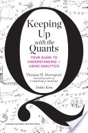

*Originally published on my old blog, [Pafnuty blog](/posts/thomas-davenport-on-creativity-in-quantitative-analysis/). Reposted here as an effort to [consolidate writing](/posts/consolidating-my-writing/) into one place. The original publication date was: June 21, 2013.*

---

The intersection of creativity and quantitative analysis is very fascinating. There is nothing surprising about the idea that good analysis requires -- or at least, can often require -- a fair bit of creativity. After all, creativity is well recognized as an important trait in the sciences, in mathematics, and in many other disciplines.

We love to hear how great ideas and great discoveries were triggered by happenstance (like watching an apple fall) or by radically different ways of thinking about familiar things (such as the idea that time and space are relative to an observer). Through these stories we acknowledge the importance of creative insight, even (especially?) in fields normally associated with methodical and systematic processes. Data analysis \* follows neatly with this line of thinking. It is quantitative, scientific, mathematical. And it requires, at it's best, innovative thought and a creative approach.

*\* Data analysis, data science, quantitative analysis -- these are loosely defined and often annoying terms. In the context of this blog post, these terms refer to the use of data to form hypotheses and build models (or products, or tools, or reports) that add some business value or inform decisions.*

But what is the nature of that creativity -- is it like artistic creativity, or something quite different? Why is it required, and to what extent can that requirement be replaced or made obsolete? How can this creativity be recognized in an individual, or encouraged in a particular team or environment? These questions are intriguing philosophically, and they also have great relevance today.

I was interested to listen to Thomas Davenport share a few of his thoughts on this subject in a recent interview hosted by analytics software reviewer [SoftwareAdvice](http://www.softwareadvice.com/bi/ "softwareadvice.com"). (There is more about the interview, with a link, below.) Davenport describes data analysis problem solving projects as being composed of three stages: "Framing the problem", "Solving the problem" and "Communicating the Results", and suggests that the stages that require the most creativity are the first stage and the last stage.

*Actually, Davenport seemed to be going out of his way to emphasize the first and third stages, more generally, throughout the interview, claiming that they were often overlooked in favor of the obvious middle stage. Perhaps the idea that more creativity is required in those two stages was just part of his attempt to draw emphasize to them.*

I agree with Davenport that creativity helps at every stage of the project. I think that there is arguably a distinct *type*of creativity unique to each stage (sounds like a fun train of thought for a follow-up post). I also agree with Davenport that the creativity required in framing a problem and forming a hypothesis is often overlooked and underestimated. I'll go even further and say that that creativity, the creativity of the first Stage, is destined to be one of the most important and most desired skills in this discipline.

It's still very difficult to apply any sophisticated algorithms to large amounts of data -- the majority of companies are happy if they can simply *count things* in their data. Davenport touches on this subject in the interview. He calls it the "big data equal small math problem" and notes that "it won't be that way forever."

It won't be that way forever because we're slowly but surely getting better at searching and organizing and querying big data. The trouble is that we don't know how to take advantage of those capabilities. What can we *do*with all this data?

Creative and sophisticated uses will be found for commonly encountered data and packaged for easy deployment or sold as a service. We see this happening in web analytics and, increasingly, in other common scenarios. But most companies also collect data that is domain specific or specialized or unique to them. Data analysts will need to understand their company's business, their challenges, their data, and find ways to put that data to good use.

We don't just need creative solutions to common problems. We need creative analysts for uncommon problems.

As a community, we have much to do. Exploratory data analysis, in the Tufte sense, is still under-developed, and there are few publicly available resources to help develop those skills. We can learn from other disciplines about creativity. We can bring our data-driven problem solving approach to understanding and improving the creative process.

I'm personally very interested in building these resources and helping the community as a whole develop creative skills in data analysis. I'm also interested, as I've told many of my data-nerd friends, in building a "data innovation consulting firm". An [IDEO](http://www.ideo.com "IDEO") for data.

---

The interview I discuss above can be found here: <http://plotting-success.softwareadvice.com/hangout-future-of-working-with-data-0613/>

Thomas Davenport is a (quite prolific) author, co-founder and research director of [International Institute for Analytics](http://iianalytics.com/ "International Institute for Analytics"), and visiting professor at [Harvard Business School](http://www.hbs.edu/ "Harvard Business School"). The interview was my first exposure to his ideas. He speaks about his new book "[Keeping Up with the Quants](http://www.amazon.com/dp/142218725X "Amazon page for Thomas Davenport's Keeping up with the Quants"): Your Guide to Understanding and Using Analytics" and addresses several subjects including creativity, the need for humans in the analytical process, the type of people that make good analysts, and advice to new graduates. His assertions on creativity were one of the underlying themes of the interview (I haven't read the book).

I found myself agreeing, in general, with much of what Davenport says. It is clear he knows his audience -- his book is described as a guide to the data-driven world for business professionals -- in that he does well to present his ideas in broad and easily understood terms. The book is co-authored by Jinho Kim, a professor of business and statistics at the Korea National Defense University, who seems to also be focused on the business side of things (PhD from Wharton) and in educating about data analysis in a business context.

As someone who often works with non-technical business folks wrestling with data-related projects, I've put the list on my to-read list, and it may turn out to be a good gift for clients.
