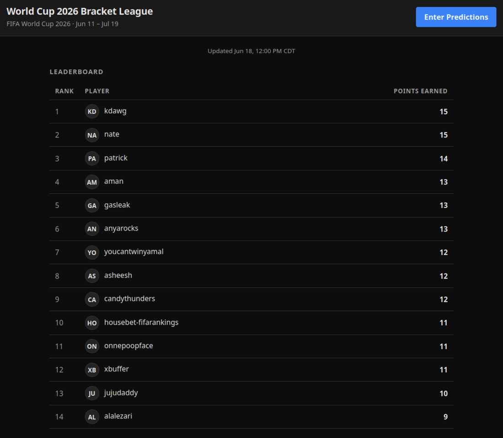
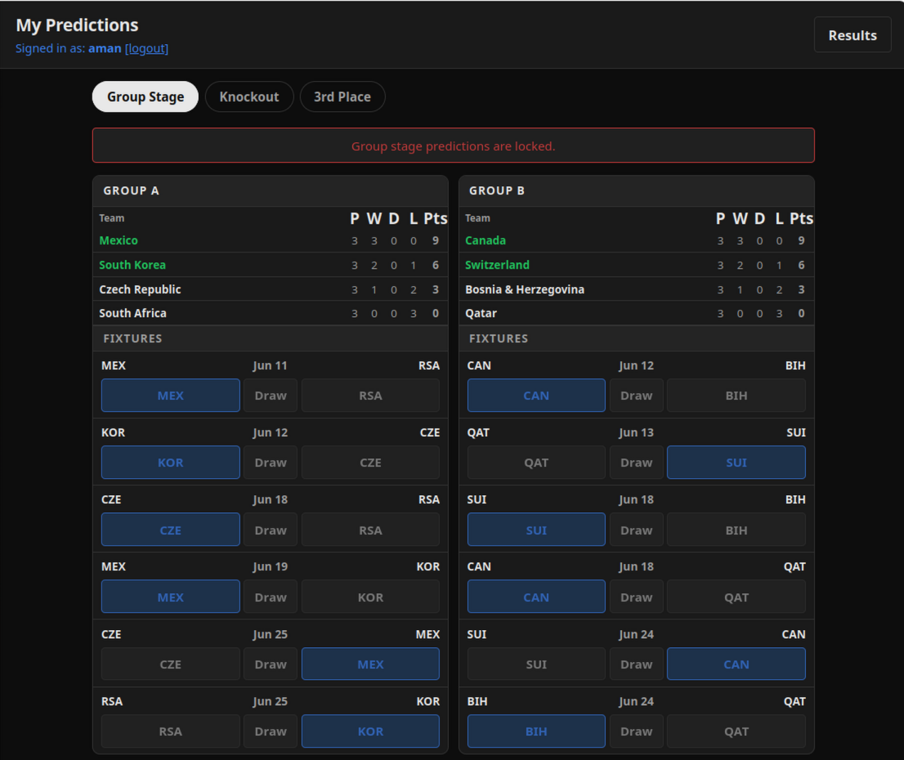
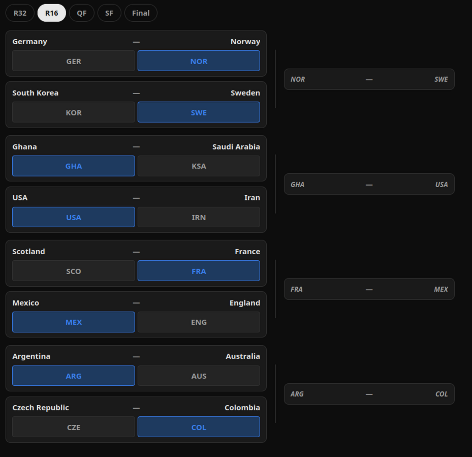

The world cup is in full swing, and my friends and I are always super
excited about it. Since 2006, and possibly also 2002, we've put together a
little fantasy-style prediction bracket which helps us all really get into
it. We boast, heckle, yell and shake fists at each game, even the matches
that otherwise wouldn't have felt as important. 

How we run the bracket is always a bit of work. It involves live documents,
deciding on rules, spreadsheets, and formulas. Some of that is part of 
the fun, but this year it felt too much. We've all been busy. There's so 
many kids, now, for chrissake. It felt impossible to update formulas and
spreadsheets after every game or every day of games. 

We could have used a fantasy app. I get that. There are tons out there.
Many are free. But I don't like 'em. They cost money, or have
advertisements, and I don't trust installing some of them on my phone, and
where's the FOSS version? I want the scoring done _just this way_, can your
app do that? 

So in my free time in the weeks leading up the cup, I just vibe-coded our
own little bracket app. 

Vibe-coded!? Yeah. As you may or may not know already, I'm generally
against this type of hands-off trust-the-machine vibe-coding (in April/May
2026), but in this particular situation it might be acceptable. 

Here's why: 
* **This is a throwaway, one-time thing.** Maintainability doesn't matter —
  in four years tech will have changed completely and I'll take a
  totally different approach for the 2030 World Cup. 
* **The stakes are low**. It's just a few friends. So scale, downtime,
  and failure consequences aren't real concerns. 
* Having done a bracket like this "very manually" for 5 or 6 world cups
  over the last 20 years, **I have a pretty good understanding** of what I
  want, and the gotchas. Having a clear spec in my head reduces risks. 
* **I am myself one of the target users.** Build with me, not for me. 

There's another reason to vibe-coding like this. I have a personal 
process for coding and developing with LLM technologies, one that is
constantly evolving. I'm very opinionated about my process. However, in my
role as a consultant / advisor on LLM technologies, I work with people and
teams who vibecode all the time. Or use different dev workflows. It helps
me to break out of "my own way" occasionally and try a completely different
workflow.

Here's a brief description of my vibe-coding process: 
* I used ChatGPT and Claude.ai (in the browser) to work through the specs,
  for desk research, to find APIs and data sources for world cup results. 
* I separately used Claude and Claude Design (the latter became available
  in the middlle of this effort) to iterate on the design. 
* I used OpenCode as a coding agent to implement, with various skills and
  models. 
* The Cloudflare setup I did manually. I'm less familiar with this, and
  wanted a good understanding of what is going on. Once setup, I created
  local utils in the terminal to work with wrangler for common operations,
  and gave the LLM agent access to those. 
* I was able do a good portion of the early steps while doing house errands
  like cleaning and dishes. Some steps of course required sitting at my 
  screen, but I deliberately kept those to a minimum until the first
  "version" was done. 

I always attempt to use local and less-powerful models, both to reduce
costs and to reduce environmental impact. For this project I used Kimi
k2.6 as a main model, and Claude Haiku 4.5 for the more complex tasks, and
when things felt stuck, I escalated to Sonnet. 

Obviously this model-switching isn't great. Some parts are well-practiced
by now and feels streamlined. But other times it's really inefficient to
try to do a task with a less powerful model, have to try multiple times,
and then in the end have to backtrack and do it with a powerful model. 

However, I am learning and revising these workflows as I go. I gain
intuition about what different models are capable of and not capable of,
and I pay attention to the token usage and costs. 

I had a few peculiarities, requirements, for this app. Some of them relate
to the World Cup itself and how I wanted to run and score the Predictions
Bracket, other had to do with the tool design or infrastructure needs. 

For example, I wanted zero or negligible costs in hosting the app. In
particular, if no one is using it, or using it infrequently, it shouldn't
be sitting somewhere using resources unnecessarily. I'm interested in
setups that are always "available yet dorman" until and unless they are
needed -- this pattern matches many of my other project and utility ideas.

For this reason the app uses Cloudflare workers and cron jobs. The workers
perform operations occasionally. The Cloudflare Pages are generated
on-demand, calculating what's needed for the user, combining it with text, 
HTML, CSS, and some client-side javascipt.  The user makes a request and
it's served up just for them. And then done. That's it. No database, it's
all in flat files, and it's all public in the repo (exception: one KV store
used for users / passwords). 

All of that fits within Cloudflare's "free" tier. It'll be sufficient
unless a whole bunch of people sign up for this bracket, but don't worry, I
don't have that many friends. 

Here's what the leaderboard looks like, a few days into the Cup

This is the screen that allows users to make predictions. It shows the
Group Stage, which is locked now -- users can't change their predictions
now that the Cup has started. 

The agent really struggled with the knockout bracket, lining up the games,
previewing the matchups in the next phase based on the user's selection. 

--- 

I'll update this post after the world cup is over with sceenshots of the
winners, 'cus that's fun, and the app should display a nice little "podium"
for 1st, 2nd, and 3rd place. We've already identified one bug that I
haven't fixed (read: told some agent to fix). I think it's interesting
to see what the agents were bad at, I'll report on that as well. 

<!--
Using images: SOCIAL PREVIEW IMAGE (og:image): No image means no thumbnail when shared on
fediverse/social. To add one, use a page bundle (see below) and add the image
path to the `images` frontmatter field. Recommended dimensions: 1200x630px.
A site-wide fallback image (the logo) could be configured in head.html when ready.

If this post needs images, convert to a page bundle:

  content/posts/my-post/
    index.md      ← rename this file
    image.png

Then reference images as: 
-->
